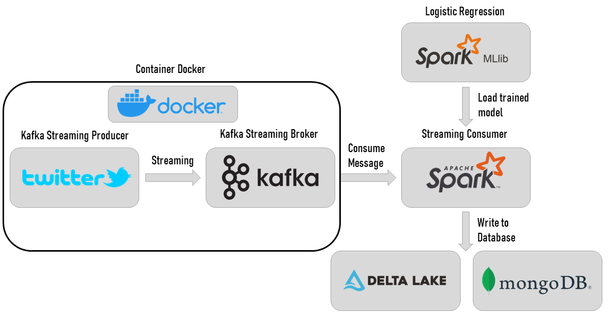

# Real-Time Tweet Sentiment Analysis with Docker, Kafka and Spark Streaming

In this repository, you will find the implementation of an ETL process for sentiment analysis of tweets in real time. The idea here is to use the best model tested offline and deploy it online for real-time analysis. For this, I used Docker, Apache Kafka and Spark Streaming. The results of this analysis can be displayed in a console, saved locally, saved to a MongoDB database or saved to a data lake such as Delta Lake.

